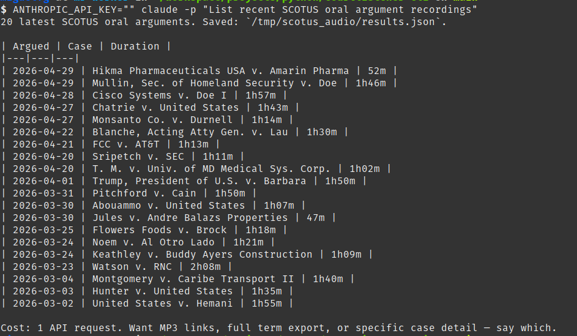

# Cookbook — courtlistener-cli skill

Real sessions run with `claude -p "<prompt>"` from the repo root. Each recipe shows the prompt, what the skill does under the hood, and the result. Every recipe costs real API quota (5 req/min, 125/day) — the skill runs `count` first when a query could fan out.

## 1. Recent SCOTUS oral arguments

```bash
claude -p "List recent SCOTUS oral argument recordings"
```

Skill runs `audio list --court scotus --limit 20`, saves JSON, and answers with a table of argued date, case name, and duration — flagging cost (1 API request) and offering follow-ups:



## 2. Count before you crawl

```bash
claude -p 'How many SCOTUS opinions match "qualified immunity"? If under 250, export them all to xlsx. If over, just report the count and the cheapest narrowing options — no follow-up questions.'
```

Skill runs `search count --q '"qualified immunity"' --type o --court scotus` first (1 request). Only if the count is affordable does it launch `search query ... --format xlsx`, estimating pages against the daily quota before starting. The "no follow-up questions" clause matters in `-p` one-shot mode — nobody is there to answer.

Example response:

> Done. **1,550** loose match (both words anywhere), **231** exact phrase "qualified immunity". Under 250 as phrase — exported all.
>
> - File: `output/scotus_qualified_immunity.xlsx` — 233 rows (2 duplicate rows from pagination drift; 231 unique cluster_ids), 35 columns.
> - Coverage: 1974–2026, all Published status. Peak years: 2012 and 2021 (10 each), 1994 (9), 2014 (9).
> - Most-cited opinion in set: 154,431 cites. `scdb_id` filled for 171 rows (Supreme Court Database link).
> - Quota used: ~15 requests of 50/hour.
>
> If loose 1,550 set is what you wanted: cheapest narrowing = exact phrase (done, 231), or add `dateFiled:[2000-01-01 TO *]` in query (1 request to count).

Unfiltered, the same phrase matches ~99k opinions across all courts (~5,000 pages ≈ 6 weeks of daily quota) — the skill reports the count and refuses the crawl instead of exporting.

## 3. Docket deep dive

```bash
claude -p "Who are the parties and attorneys in docket 4214664, and what are its latest entries?"
```

Three commands, one docket:

```
parties list --docket 4214664
attorneys list --docket 4214664
docket-entries list --docket 4214664 --limit 25
```

Answer merges them: party roles, counsel per party, most recent filings.

Example response:

> Docket 4214664 = **National Veterans Legal Services Program v. United States**, D.D.C. 1:16-cv-00745, Judge Paul L. Friedman — the PACER-fees class action. Filed 2016-04-21, last filing 2026-06-17, 327 total entries, 35 parties.
>
> **Plaintiffs (3):** National Veterans Legal Services Program, National Consumer Law Center, Alliance for Justice. Shared counsel: William H. Narwold, Meghan S.B. Oliver (both Motley Rice; lead, pro hac vice), Jonathan E. Taylor and Deepak Gupta (Gupta Wessler), Elizabeth Smith.
>
> **Defendant:** United States of America. Active counsel: Brenda A. Gonzalez Horowitz (lead). Terminated over case life: Derek S. Hammond, Jeremy S. Simon, Robert Aaron Caplen, Brian J. Field, William Mark Nebeker.
>
> **Amici (25):** big press coalition (Reporters Committee for Freedom of the Press, AP Media Editors, Seattle Times, Center for Investigative Reporting, Reporters Without Borders, etc.) all via Bruce D. Brown; law/tech scholars (Jonathan Zittrain, Phillip Malone, Thomas Bruce, Deborah Beim, American Association of Law Libraries) via Sasha Samberg-Champion; former legislators Darrell Issa and Joseph Lieberman via Mark Bailen.
>
> **Interested parties (4):** Eric Alan Isaacson (pro se objector), Troy Law PLLC (John Troy), Rob Rawson, Rosemarie Howell. **Movants (2):** Michael T. Pines, Don Kozich (pro se).
>
> **Latest entries — case is over**
>
> - **#178, 2026-06-12** — Federal Circuit **mandate** issued on objector Isaacson's appeal (USCA 24-1757); USCA judgment dated 2026-03-20. Settlement now final.
> - **#177, 2024-10-30** — leave to file pro se letter denied.
> - **#175–176, May 2024** — hearing transcripts issued.
> - **#171–174, Apr 2024** — Isaacson's notice of appeal to Federal Circuit ($605 fee; earlier D.C. Circuit notice entered in error).
> - **#169–170, 2024-03-20** — **Opinion and Final Judgment approving the class settlement** plus attorneys' fees, costs, service awards.
>
> Raw exports in `output/docket4214664/` (docket.json, parties.json, attorneys.json, entries.json). Quota used: ~7 requests.

## 4. Batch lookup from a spreadsheet

```bash
claude -p "Look up every docket number in data/dockets.xlsx in the dcd court and export to xlsx"
```

Skill runs `dockets list data/dockets.xlsx --column docketNumber --court dcd --format xlsx`. One paginated query per row; results carry `_query_value` tracing which input row matched. Skill warns first when the sheet has many rows (each row ≥ 1 request).

Example response (5-row input sheet):

> Done. Exported 16 dockets to `results/results.xlsx`.
>
> Per docket number:
> - `1:22-cr-00015` — 12 rows: *United States v. Rhodes III* (Jan 6 seditious conspiracy), one docket per defendant (defendant numbers 1–11 plus main)
> - `1:20-cv-03010` — 2 rows: *United States v. Google LLC* (antitrust)
> - `1:21-cv-00400` — 1 row: *Lee v. Trump*
> - `1:23-cv-02043` — 1 row: *Shakoori v. Blinken*
> - `3:22-cv-07182` — **0 rows in dcd**. Office prefix `3:` not DC district; likely N.D. Cal. Rerun without `--court dcd` or with correct court if wanted.
>
> Each row has `_query_value` column tracing back to input docket number. 5 API requests used.

Note the fan-out: one docket number can match several dockets (per-defendant criminal dockets), and a zero-match row gets diagnosed instead of silently dropped.

## 5. Citation hallucination check

```bash
claude -p "Check whether the citations in this text are real: Obergefell v. Hodges (576 U.S. 644) established the right to marriage, following Roe v. Wade (410 U.S. 113)."
```

Skill runs `citation-lookup text --text "..."` and reports per citation: found (200), not found (404 — possible hallucination), ambiguous (300), with the matched clusters.

<!-- TODO screenshot: verdict list with statuses -->

## 6. Profile an export

```bash
claude -p "Summarize the latest results file in ./output — top courts, per-year volume, empty columns"
```

No API request. Skill runs `scripts/result_stats.py <file>` and interprets: dominant courts, filing volume per year, date-coverage gaps, columns that came back empty (usually a wrong filter or search type).

<!-- TODO screenshot: stats profile + interpretation -->

## Screenshots still to capture

Run the recipe's `claude -p` command, screenshot the terminal answer, drop the PNG in `assets/`, replace the TODO comment with ``.

| Recipe | Suggested filename |
|---|---|
| 5 — citation check | `demo-citation-check.png` |
| 6 — stats profile | `demo-result-stats.png` |
